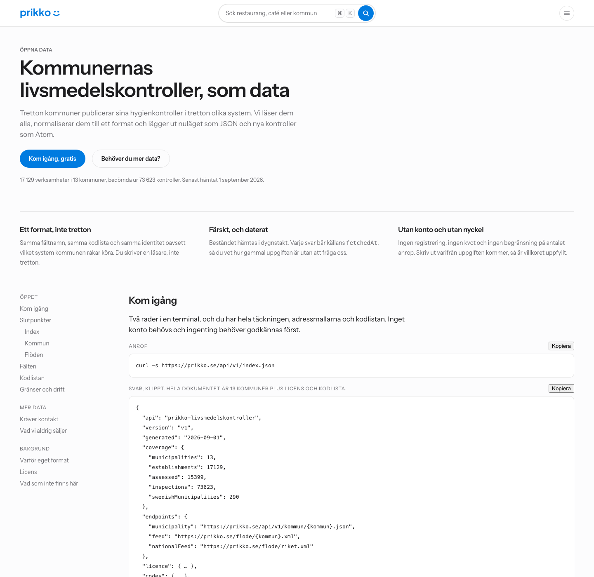
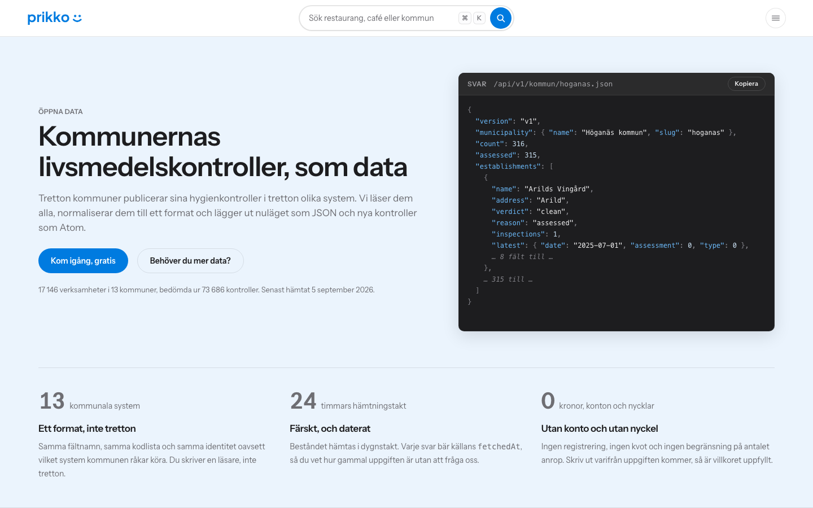
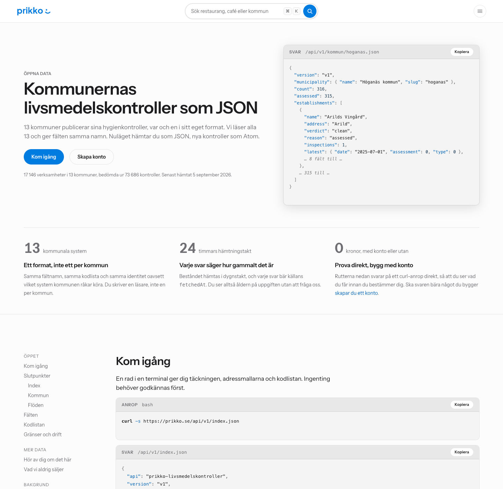
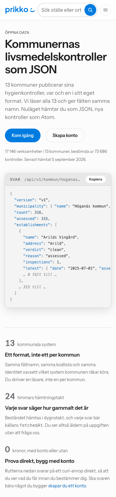
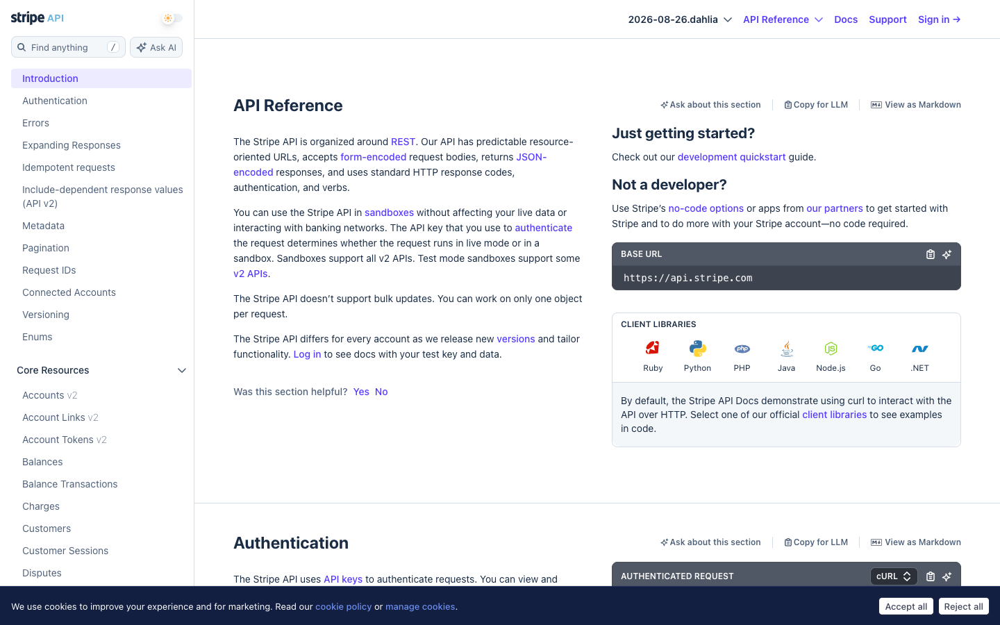

# 55. Det publika API:et och flödena

**Datum:** 2026-08-31
**Beställning:** `docs/45_entreprenorslistan.md` B1 (publikt API och öppna data),
B6 (flöden) och H2 (LIVES som färdigt schema).
**Vad som byggdes:** ett statiskt JSON-API på `/api/v1/`, Atom-flöden på
`/flode/`, och dokumentationssidan `/api/`. Ingen server, inga nya beroenden.

---

## 1. Slutsatsen först

**Eget format med den svenska specifikationens ordförråd, inte LIVES.**
LIVES bygger på ett poängtal vi inte har, saknar identitet per kontroll, och
är till sin form en zip med fem CSV-filer, alltså precis den massnedladdning
vi inte publicerar.

**Levererat i två steg, och skillnaden är ett konto och inte en rad kod.**

| Vad | Adress | Steg | Filer |
|---|---|---|---:|
| Index, täckning och kodlista | `/api/v1/index.json` | **ett, på** | 1 |
| Nuläget i en kommun | `/api/v1/kommun/{kommun}.json` | **ett, på** | 13 |
| Nya kontroller | `/flode/{kommun}.xml` och `/flode/riket.xml` | **ett, på** | 14 |
| Dokumentationen | `/api/` | **ett, på** | 1 |
| En verksamhet med historik | `/api/v1/verksamhet/{kommun}/{slug}.json` | två, av | 17 066 |

**Steg ett kostar 29 filer och utgåvan hamnar på 18 084 av gratisplanens
20 000.** Det är den delen som ger backlänkar, citeringar och
färskhetssignalen, alltså hela poängen med B1 och B6.

**Steg två är skrivet, byggt och verifierat, men avstängt.** Det kostar 17 066
filer och tar utgåvan till 35 150, vilket ryms på Workers Paid men inte på
gratisplanen. Avstängningen är konstanten `PER_VERKSAMHET` i `lib/api.ts`, se
avsnitt 5.2.

**Varför den inte bara rullas ut ändå: felet är tyst.** `filtaksgrind()`
varnar mellan 19 000 och 90 000 men fäller först vid 98 000. Ett bygge på
35 150 filer är alltså grönt hos oss medan Cloudflare avvisar utgåvan, och
sajten står kvar på gårdagens bygge utan att något säger ifrån.

**Licensen i tre meningar.** Kommunernas underlag bär varken upphovsrätt eller
katalogskydd, eftersom 9 § upphovsrättslagen undantar yttranden av svenska
myndigheter och 49 § tredje stycket låter det undantaget gälla även för en
sammanställning. Ingen av de tretton kommunerna har skrivit ett enda villkor
för vidareutnyttjande, så det finns inget villkor att bryta mot och ingen
kommun som måste hanteras särskilt. Vårt eget arbete, alltså normaliseringen,
identifierarna och bedömningen, erbjuds under CC BY 4.0, medan bilderna och
OSM-fälten står under andras villkor och därför inte ingår i API:et alls.

---

## 2. Formatvalet: LIVES prövades på riktigt

`docs/45` H2 rekommenderade LIVES med ett argument som är rätt i sak: ett
etablerat format som andra redan kan läsa är värt mer än ett eget som är en
aning bättre. Frågan prövades därför mot den faktiska specifikationen och mot
de flöden som är i drift i dag, och inte mot minnet av den.

### 2.1 Vad LIVES faktiskt är

Specifikationen ligger på `yelp.com/healthscores` och har ingen annan
kanonisk plats. Det finns inget arkiv hos Yelp, ingen ändringslogg och ingen
validator; onboarding sker genom att man mejlar in en zip. Sidans egen sista
rad säger att det här är version 2.0 och att den senast uppdaterades den
10 augusti 2015.

Fem filer, varav tre obligatoriska:

| Fil | Krav | Fält |
|---|---|---|
| `businesses.csv` | ja | `business_id`, `name`, `address`, `city`, `state`, `postal_code`, `latitude`, `longitude`, `phone_number` |
| `inspections.csv` | ja | `business_id`, `date`, `score`, `result`, `description`, `type` |
| `feed_info.csv` | ja | `feed_date`, `feed_version`, `municipality_name`, `municipality_url`, `contact_email` |
| `violations.csv` | nej | `business_id`, `date`, `description`, `code`, `critical` |
| `legend.csv` | nej | `minimum_score`, `maximum_score`, `description` |

### 2.2 Fyra skäl att inte använda det

**1. Poängtalet finns inte i svensk kontroll.** `score` är ett tal mellan noll
och hundra där hundra är bäst. Svenska kommuner sätter inget sådant tal.
Alternativfältet `result` rymmer **fyra tecken**, alltså varken "Brister"
eller "Brister som kvarstår". Vi hade tvingats antingen lämna fältet tomt,
vilket bryter mot specifikationen, eller räkna om vår bedömning till ett
poängtal. Det senare vore värre än att avstå: `verdict` är **Prikkos** slutsats
och inte kommunens betyg, och ett fält som heter `score` i ett flöde som heter
efter en kommun läses av alla som myndighetens tal.

Att fältet dessutom är opålitligt i praktiken är belagt. Boulder Countys
levande flöde har poäng mellan **0 och 115**, med noll som vanligaste värde
(419 av 1 270 rader). Det är uppenbart en anmärkningspoängskala där lågt är
bra, alltså tvärtemot vad specifikationen säger, och de skickar ingen
`legend.csv` som avslöjar det. Ett format där halva innebörden ligger i en
valfri fil är inget skydd mot missförstånd.

**2. LIVES har ingen identitet per kontroll.** Det finns inget
`inspection_id` någonstans i specifikationen. En avvikelse i `violations.csv`
kopplas till en verksamhet och ett datum, inte till kontrollen den gäller. I
Wake Countys levande flöde bär **267 av 56 087** kombinationer av verksamhet
och datum mer än en kontroll, och för dem går avvikelserna inte att härleda
till rätt kontroll alls.

Det är dyrt just för oss. Vår `Inspection.id` binder ihop kontrollen, dess
kontrollpunkter och flödesposten, och hela bedömningsmodellen vilar på att en
uppföljning går att skilja från kontrollen den följer på. LIVES kan inte
uttrycka den kopplingen.

**3. Formen ÄR en massnedladdning.** LIVES är en zip med hela jurisdiktionens
verksamheter, kontroller och avvikelser. Att publicera i LIVES är alltså per
definition att publicera det avsnitt 4 säger att vi inte publicerar. De två
besluten går inte att ha samtidigt.

**4. Ekosystemet är inte levande.** Yelps egen registersida listar 247
jurisdiktioner, och **237 av dem levereras av en kommersiell part**, Ecolabs
Health Department Intelligence, tidigare Hazel Analytics. Bara tio kommuner
publicerar fortfarande ett eget flöde, och av dem svarade fem vid mätningen
den 31 augusti 2026: Wake County, San Bernardino, Contra Costa, Williamson
och Boulder. Marin County svarade 403, och fyra hade slutat svara helt.
**Endast Contra Costa deklarerar version 2.0**; övriga skickar `1.0`, `1`
eller `0.4.1`.

Båda de kommuner som en gång tog fram formatet, San Francisco och New York,
ligger i dag i Ecolab-gruppen. San Franciscos egen datamängd heter numera
"[Historical] Restaurant Inspection Scores (2016-2019)" och uppdaterades
senast 2021.

Även Montreal, som `docs/45` H2 pekar ut, är svagare än den såg ut. De står
inte på Yelps lista, publicerar ingen zip, och **saknar `inspections.csv`
helt**, alltså en av de tre obligatoriska filerna. Deras `violations.csv` är i
sak en lista över domar och inte över kontrollavvikelser. Licensen CC BY 4.0
stämmer, resten är LIVES-inspirerat snarare än LIVES.

Kvar av argumentet står alltså inte "andra kan redan läsa det" utan "en
kommersiell aktör kan läsa det", och just den aktören driver enligt `docs/45`
§6.4 nästan 700 000 Yelp-sidor på samma affär som vår. Att lämna vår data i
deras format och sedan konkurrera med dem är en dålig affär.

### 2.3 Vad vi valde i stället, och vad vi lånar

**Fältnamnen kommer ur den svenska nationella specifikationen**,
*Livsmedelskontroller som öppna data v2.0*, framtagen av NSÖD och ÖDIS ovanpå
Sambruks och SKL:s arbete. `docs/42` §4 har hela JSON-exemplet. Den bär exakt
det svensk kontroll innehåller: `assessment`, `type`, `prenotified`,
`inspectionPoints` med godkända och anmärkta punkter var för sig,
`ownerComment`, `organizationNumber` och koordinater.

Att våra fält redan heter så är ingen tillfällighet: `db.ts` byggdes mot
samma vokabulär. Valet här är alltså att inte överge den till förmån för
LIVES, och det ska sägas rakt ut vad valet är värt.

**Vi lånar formen och går inte med i något.** Noll svenska kommuner publicerar
i specifikationen, vilket `docs/42` §1 och §3.2 mätte. Vi ansluter oss alltså
inte till ett ekosystem, vi lånar ett ordförråd som är genomtänkt och svenskt.
Skillnaden är värd att hålla i minnet: den dagen ett svar på ett begäranbrev
kommer i NSÖD-format är det läsaren som ska byggas först, och då talar vi
redan samma språk.

**Dokumentformen är däremot vår egen.** NSÖD:s exempel är ett dokument per
kontrollmyndighet med `facilities[]` och `inspections[]` bredvid varandra,
alltså också en dumpform. Vår enhet är en verksamhet per dokument, av skälen i
avsnitt 4.

---

## 3. Adresserna

Ett API är ett löfte, och versionen står i adressen för att löftet ska gå att
hålla utan att frysa formen för alltid.

    /api/v1/index.json                        på
    /api/v1/kommun/{kommun}.json              på
    /flode/{kommun}.xml                       på
    /flode/riket.xml                          på
    /api/                                     på, dokumentationen som HTML
    /api/v1/verksamhet/{kommun}/{slug}.json   AV, väntar på uppgraderingen

**ADRESSEN FÖR STEG TVÅ ÄR BESTÄMD HÄR OCH NU, OCH FÅR INTE ÄNDRAS.** Det är
skälet till att den står utskriven ovan trots att den ännu inte svarar. Ett
API är ett löfte, och löftet börjar gälla den dag adressen publiceras i det
här dokumentet och inte den dag den börjar svara. Den som läser detta och
bygger mot den formen ska ha rätt.

**Sidan `/api/` dokumenterar den däremot INTE**, och de två är inte i konflikt.
Ett API som beskriver en adress som svarar 404 för sin läsare är sämre än ett
som beskriver mindre. Här står den som ett åtagande inför oss själva, där
skulle den stått som ett erbjudande till någon annan. Avsnittet tänds av sig
självt när flaggan slås om; se `PER_VERKSAMHET` i `pages/api/index.astro`.

**Regeln för v1:** ett fält får läggas till när som helst, eftersom en läsare
som inte känner till det ignorerar det. Ett fält som ska bort eller byta
betydelse kräver `/api/v2/` vid sidan om, och v1 står kvar.

**Verksamhetens adress är sidans adress med ett prefix och en ändelse.**
`/stockholm/vesuvio/` blir `/api/v1/verksamhet/stockholm/vesuvio.json`. Den
som har en länk kan alltså räkna fram dokumentet utan att slå upp något, och
`ADR 0003` gör slugen permanent, så de två följs åt.

**Flödena ligger utanför `/api/` med flit.** En flödesadress hamnar i någons
läsare och ska överleva en `v2`. Atom är dessutom bakåtkompatibelt av
konstruktion.

**`/api/` är sidan och `/api/v1/` är datan, och den nivån är inte kosmetisk.**
`_headers` sätter `Content-Type: application/json` på ett mönster, och ett
mönster på `/api/*` hade träffat dokumentationssidan också och fått
webbläsaren att ladda ner den. Under `/api/` ligger dessutom sedan tidigare
två Pages Functions, `functions/api/marke.ts` och `functions/api/ratta.ts`,
vilket är ett andra skäl att hålla mönstret smalt.

---

## 4. Vad som publiceras, och vad som medvetet inte gör det

### 4.1 Regeln

**API:et säger om en verksamhet exakt det verksamhetens egen sida säger,
varken mer eller mindre.**

Hela gränsdragningen följer ur den meningen. Ett API som säger mindre än
HTML:en på samma adress skyddar ingenting, eftersom den som vill ha uppgiften
läser sidan i stället. Ett API som säger mer är en ny publicering som ingen
granskat: `compliance` och `frequency` i `Registration` visas med flit inte på
sajten, och de står därför inte heller i ett svar.

### 4.2 Ingen massnedladdning

`docs/11` §10 och `docs/45` C4 räknar det normaliserade nationella materialet
som en intäktsström. En dumpfil är hela den produkten i en förfrågan.

Gränsen är därför: **kommunfilen bär nuläget, historiken finns bara per
verksamhet, och det finns ingen fil som bär hela beståndet.** Det är samma
gräns sajten själv har, eftersom ingen sida visar allt på en gång.

**I dag är gränsen strängare än så, och det är en följd och inte ett beslut.**
Med `PER_VERKSAMHET` avstängd publiceras kontrollhistoriken inte alls, bara
nuläget. Det är alltså filtaket och inte affärsmodellen som håller igen just
nu, och den dag flaggan slås om är gränsen den som står i stycket ovan.

**Var ärlig om vad gränsen är värd när den väl gäller.** Den som vill bygga en
spegel kan hämta 17 066 filer och sätta ihop en. Friktionen är 17 066
förfrågningar mot en, och det är en tröskel och inte ett lås. Det som faktiskt
inte går att få gratis är tidsserien över hela riket i ett svep, alltså den
enda delen C4 säljer. Om gränsen någon gång ska ersättas av ett riktigt lås är
svaret inte att publicera mindre, utan att sälja mer.

### 4.3 Bilderna och OSM-fälten, som är en annan sorts nej

De två föregående nejen är våra egna beslut och kan ändras. De här kan de
inte, eftersom de är tredje mans villkor.

**Bilderna** kommer från Mapillary, Panoramax och Wikimedia Commons, och
villkoren gäller per bild: en kräver logotyp och länk, en annan fotografens
namn, licensnamnet och en länk till filsidan. Ett JSON-fält kan bära en URL
men inte tvinga mottagaren att rita attributionen, och en bild som visas utan
sin attribution är ett brutet villkor hos oss. Se `StreetImage` i `db.ts`.

**Öppettider, kontaktuppgifter, hållplats och parkering** kommer alla ur
OpenStreetMap under ODbL 1.0, som är share-alike. Att lägga dem i ett svar vi
märker CC BY vore att sätta villkor vi inte har rätt att sätta.

---

## 5. Filkostnaden, räknad

### 5.1 Steg ett, som är på

| Post | Filer |
|---|---:|
| En per kommun | 13 |
| Flöden, tretton kommuner plus riket | 14 |
| Index | 1 |
| Dokumentationssidan | 1 |
| **Summa** | **29** |

Utgåvan går från 18 055 till **18 084** filer, mätt i bygget. Det är 1 916
kvar till gratisplanens tak på 20 000 och 916 under `GRATIS_VARNING` på
19 000, alltså går ingen byggvarning igång: loggen skriver bara
`18084 filer i utgåvan, 79916 kvar till taket`.

Kommunfilerna väger 8,2 MB på disk och flödena 544 kB. Stockholm är 5,0 MB av
de 8,2 och 646 kB gzippad; se 9.3 för varför den är stor och varför det är
rätt ändå.

### 5.2 Steg två, som är avstängt

En fil per verksamhet är **17 066 filer**, och utgåvan blir då 35 150.

**Talet 15 365 i beställningen är antalet BEDÖMDA verksamheter, inte antalet
verksamheter.** 15 492 har minst en kontroll och 17 066 finns i beståndet.
Rutten bygger alla 17 066, eftersom kommunfilen räknar upp dem och en 404 på
en verksamhet som står i kommunfilen hade varit ett API som säger emot sig
självt. De 1 574 utan bedömning bär `verdict: null` och ett `reason`.

**Avstängningen är en konstant och inte en bortkommenterad fil.**
`PER_VERKSAMHET` i `site/src/lib/api.ts`, i dag `false`. Fyra ställen läser
den, och alla fyra följer med av sig själva när den slås om:

| Läsare | Vad som händer när flaggan är falsk |
|---|---|
| `pages/api/v1/verksamhet/[kommun]/[slug].json.ts` | `getStaticPaths()` ger tom lista, noll filer |
| `nulage()` i `lib/api.ts` | fältet `api` utelämnas ur kommunfilens rader |
| `apiIndex()` | `endpoints.establishment` utelämnas |
| `pages/api/index.astro` | adressraden och härledningsexemplet utelämnas |

Konstanten valdes framför en gren vid sidan om, med flit. Rutten byggs och
typkontrolleras vid varje körning, och `verksamhetDokument()` är oförändrad
sedan bygget som producerade samtliga 17 066 dokument. En gren hade ruttnat i
tysthet; en flagga kan inte.

**Villkoret för att slå på den:** kontot uppgraderat till Workers Paid, alltså
steg ett i `docs/46` §6. Fem dollar i månaden och ett klick, och det är
ägarens beslut.

### 5.3 Varför gränsen inte fick passeras med en varning

Grinden i `astro.config.mjs` fäller vid 98 000 och Cloudflare Pages tar
100 000 på Workers Paid. 35 150 ryms alltså där med god marginal.

**Men kontot ligger på gratisplanen, vars tak är 20 000, och det felet är
tyst.** `filtaksgrind()` varnar mellan `GRATIS_VARNING` 19 000 och
`FILTAK_VARNING` 90 000 men fäller inte. Ett bygge på 35 150 filer hade alltså
varit grönt hos oss, GitHub Actions hade rapporterat en varning bland andra
varningar, och Cloudflare hade avvisat utgåvan medan sajten stod kvar på
gårdagens. Att gå in med en varning som enda skydd är samma fel som höll ett
nattjobb nere i tretton dagar utan att någon märkte det.

Marginalen var dessutom knapp redan innan: kommentaren i `astro.config.mjs`
noterar 18 048 filer den 31 augusti och det här bygget mätte 18 055 utan
API:et, alltså under tvåtusen kvar hur man än räknar.

### 5.4 Riket och API:et ryms inte båda

`docs/46` §3.2 räknar hela riket till omkring 97 400 filer utan API. **Med en
fil per verksamhet blir hela riket ungefär det dubbla, alltså över taket på
100 000.** Det är en verklig begränsning och den ska stå skriven här innan
någon planerar riksutbyggnaden. Se 5.5 för vägen förbi.

### 5.5 Om filtaket blir bindande även efter uppgraderingen

`site/functions/api/` finns redan och kör två Pages Functions. Samma svar går
att sätta ihop där vid begäran och kostar då **noll filer** i bygget.
Beställningen sa statiska filer och ingen server, alltså är det inte byggt,
men vägen är öppen och den kostar ingen adressändring: `_headers` och
adresserna ser likadana ut åt en anropare oavsett vilken av de två som
svarar. Det är samma resonemang `functions/api/marke.ts` redan för om 34 386
dekalfiler.

---

## 6. Flödena: Atom, och varför

**Google tar emot ett flöde som sitemap.** RSS 2.0 och Atom 1.0 är båda
dokumenterade sitemapformat, och det är skälet flödena står högt just nu:
`docs/49` mätte att omkring **1 400 av 14 260 sidor** är i Google, alltså
omkring tio procent. Ett flöde per kommun som anmäls vid sidan av
XML-sitemapen är en andra väg in för precis de sidor som ändrats, och det
kostar fjorton filer.

**Atom framför RSS**, av tre skäl i fallande ordning:

1. `<id>` är obligatorisk i Atom och `<guid>` valfri i RSS. Vår
   `Inspection.id` är redan beständig, så kravet kostar oss ingenting och ger
   läsaren garantin att en post inte dyker upp som ny igen när en verksamhet
   byter slug. Posten identifieras med en `tag:`-URI enligt RFC 4151 och
   aldrig med sin URL: en URL säger var något ligger, inte vad det är.
2. Atom daterar i RFC 3339, samma form som `lastmod` i sitemapen redan
   använder. En glidning mindre på den signal som betyder mest för oss.
3. Atom är RFC 4287 och läses av allt som läser RSS. RSS 2.0 är ingen
   standard i den meningen.

**Femtio poster per kommun, 150 för riket.** Riksflödet blandar tretton
kommuner och behöver fler poster för samma räckvidd i tid.

**Ordningen är total och inte bara sorterad på datum.** Källorna har
dagsupplösning, alltså delar ett femtiotal kontroller samma datum. Utan andra
och tredje sorteringsled hade två byggen på samma data kunnat ge olika flöden,
och varje prenumerant hade sett gamla poster som nya. Verksamhetens id och
kontrollens id avgör resten.

**Flödets `<updated>` är den färskaste postens datum, aldrig byggtiden.**
Samma skäl som `lastmodIndex()` i `astro.config.mjs`: en tidsstämpel som
ändras vid varje bygge är per definition inte trovärdig och ignoreras då i sin
helhet.

**Ingen post länkar till en `noindex`-sida.** Flödet filtrerar med
`isIndexable()`. Att be en läsare gå till en sida vi själva sagt inte ska
hittas är motsägelsefullt.

**XML:en skrivs för hand.** `@astrojs/rss` finns inte i `package.json` och
läggs inte till: paketet skriver RSS, och en beroendekedja för tolv rader XML
är dyrare än raderna.

---

## 7. Licensbedömningen

### 7.1 De två lagren

**Underlaget är fritt, och inte tack vare oss.** Ett kontrollresultat är ett
yttrande av en svensk myndighet. 9 § upphovsrättslagen (1960:729):

> "Upphovsrätt gäller inte till 1. författningar, 2. beslut av myndigheter,
> 3. yttranden av svenska myndigheter [...]"

Katalogskyddet i 49 § är den verkliga frågan för en tabell, men dess tredje
stycke räknar upp 9 § bland de bestämmelser som gäller även för ett sådant
arbete. Sammanställningen skyddas alltså inte heller. Hela kedjan står
utskriven med lagtext i `docs/20` §9.3, där den prövades för Norrköping, och
den generaliserar eftersom materialet är av samma slag i varje kommun:
kontrollrapporter från en kommunal nämnd.

**Vårt eget arbete är normaliseringen, identifierarna och bedömningen**, och
det erbjuds under **CC BY 4.0**. Attributionsraden står i `LICENCE` i
`lib/api.ts` och följer med i varje enskilt svar, inte bara i indexet: ett
dokument som kopieras vidare tappar sin kontext, och då är licensen det första
som försvinner.

**Inte CC0.** `kallor.astro` bar en gång CC0 i sitt Dataset-schema medan den
synliga texten sa något annat, och en CC0-märkning är oåterkallelig för den
som hunnit förlita sig på den. Att avsäga sig rätten till bedömningen är
dessutom ett affärsbeslut och inte ett tekniskt.

### 7.2 Kommunerna, en efter en

Frågan är ställd som `docs/prikko-licens-lasas-som-den-star` kräver: villkoren
läses som de står, och aldrig i den snålaste tolkningen.

**Ingen av de tretton kommunerna har skrivit ett enda villkor**, varken en
licensmärkning eller ett förbud, och det står i varje svar som
`"licence": "unstated"` per kommun. Fältet finns för att den som bygger vidare
ska kunna se det själv i stället för att lita på ett medelvärde vi räknat åt
hen, och för att en kommun som framöver ställer ett villkor ska synas i datan
innan den syns i en text.

**Så långt påståendet är belagt, och var det inte är det.** `docs/42` gick
igenom dataportal.se systematiskt med trettiosju sökningar och fann ingen
livsmedelsdatamängd med licens utanför Göteborg, Stockholm och Norrköping.
`docs/20` §9.3 prövade Norrköping särskilt och ordagrant. För de elva
kommuner vi läser genom deras egna gränssnitt vilar påståendet på vår egen
källpost, som inte bär något licensfält, och deras sidor är inte omlästa för
det här dokumentet. Det är en öppen punkt, se avsnitt 10, och den ändrar inte
slutsatsen: grunden är lagtexten i 7.1 och inte frånvaron av en märkning.

**Tystnaden bär inte slutsatsen.** Att ingen licens är angiven är varken ett
förbud eller ett tillstånd. Grunden är lagtexten i 7.1. Hade slutsatsen behövt
tystnaden hade den inte hållit.

**Ingen kommun måste hanteras särskilt, och det är ett resultat och inte en
lucka.** Beställningen förutsåg att någon kommuns villkor kunde hindra
vidarelicensiering. Ingen gör det, eftersom ingen har ställt något villkor och
ingen kan ställa ett i efterhand som gäller retroaktivt: 2 kap. 5 § lagen
(2022:818) kräver att ett villkor är objektivt och icke-diskriminerande, och
ett outtalat villkor kan omöjligt vara det.

Två saker som gränsar till frågan men inte avgörs här:

- **Stockholms ArcGIS-lager är CC0**, men vi läser inte det. Vi läser deras
  e-tjänst. Se `docs/52`, som rekommenderar att lagret inte hämtas.
- **Norrköpings utdrag är inaktuellt**, senaste kontroll 2024-01-03 och filen
  skriven 2024-03-17. Det är en färskhetsfråga och inte en licensfråga, och
  den syns i svaret som `modifiedAt` vid sidan av `fetchedAt`.

### 7.3 Ett argument att spara till kommunbreven

Hazel Analytics, alltså den part som i dag levererar 237 av Yelps 247
LIVES-flöden, skriver själva att deras insamlingsmetoder är billigare och
snabbare för myndigheterna än de utlämnandebegäranden som annars hade krävts.
Det är exakt vårt argument mot en kommun som tvekar inför H1 och B12, och det
kommer från någon som byggt affären på det.

---

## 8. Huvudena, och varför de inte står i rutterna

`public/_headers` förklarar utförligt att ett `Response`-huvud i en Astro-rutt
KASTAS i ett statiskt bygge, och att det kostade en trasig karta i produktion.
Rutterna här sätter ändå sina huvuden, som avsiktsförklaring och av samma skäl
som `sok-index/[hash].json.ts` gör det, men det som gäller står i `_headers`:

    /api/v1/*      application/json, max-age=3600, Access-Control-Allow-Origin: *
    /flode/*       application/atom+xml, max-age=3600, Access-Control-Allow-Origin: *

Tre saker är värda att veta.

**CORS finns bara där och kan bara finnas där.** Utan
`Access-Control-Allow-Origin: *` kan ingen webbsida någon annan bygger läsa ett
av våra svar. Ett API vars hela poäng är att andra bygger på det, och som ingen
kan anropa, är ett API som inte finns.

**Mönstret heter `/api/v1/*` och inte `/api/*`**, se avsnitt 3.

**`.json` och `.xml` cachas inte på Cloudflares kant.** Mätningen står högst
upp i `_headers`: `/sok-index/*.json` svarade DYNAMIC trots `max-age=31536000,
immutable`, eftersom kanten cachar ur en fast lista av filändelser som `.json`
inte står på. `Cache-Control` styr alltså webbläsarens cache och inte kantens,
och varje anrop går till origin. Det är acceptabelt här och var det inte för
kartan, som gick sönder eftersom PMTiles läser med `Range`. Ett API-anrop
hämtar hela dokumentet ändå, så det som kostar är svarstid och inte funktion.
Att byta ändelse för kantens skull är inget alternativ: `.json` är en del av
adressen, och adressen är löftet.

---

## 9. Verifieringen

Två byggen i ett eget arbetsträd med `--outDir dist-api`, med huvudkopians
`node_modules` länkad och länken borttagen efteråt. Det första med
`PER_VERKSAMHET = true`, för att mäta steg två och bevisa att koden fungerar.
Det andra med flaggan i sitt levererade läge, `false`.

### 9.1 Bygget med steg två på, alltså mätningen av det avstängda

Gick igenom med samtliga grindar gröna, byggtid 2 min 52 s.

| Katalog | Filer | På disk |
|---|---:|---:|
| `api/v1/verksamhet/` | 17 066 | 95 MB |
| `api/v1/kommun/` | 13 | 9,5 MB |
| `api/v1/index.json` | 1 | 9,2 kB |
| `flode/` | 14 | 544 kB |
| `api/index.html` | 1 | |
| **Summa nytt** | **17 095** | |

Utgåvan landade på **35 150** filer. Talen stämmer på filen: 35 150 minus
17 095 är 18 055, alltså exakt vad utgåvan låg på före arbetet.

Det är den mätningen som gör `PER_VERKSAMHET` till en avstängning och inte
till ett löfte: koden har producerat samtliga 17 066 dokument, och
`verksamhetDokument()` är oförändrad sedan dess.

### 9.2 Bygget som levereras, alltså steg ett

Byggtid 3 min 13 s, 17 806 sidor, **18 084 filer**. Filantalet står i 5.1.

**Ingen byggvarning gick igång**, vilket var hela villkoret: `filtak` skrev
`18084 filer i utgåvan, 79916 kvar till taket` och ingenting mer. Talet ligger
916 under `GRATIS_VARNING`.

**Grindarna sa vad de skulle.** `sitemap-guard` räknade 16 097 URL:er utan en
enda motsägelse mot `noindex`. Sitemapen gick från 16 096 adresser till
16 097, alltså exakt en ny, och den är dokumentationssidan. Gruppen `start`
står på **tretton**, alltså elva namngivna toppsidor plus roten plus den nya
`/api/`: sidan är klassificerad i `sidtyp()` och ingenting hamnade i
restgruppen `sitemap-pages-0.xml`, vars blotta existens hade fällt bygget.
`lankgrind` hittade inga döda interna länkar, alltså håller länken från
webbkartan och länken från källsidan.

**Datarutterna når aldrig sitemapen**, vilket var antagandet bakom att bara
sidan står i `sidtyp()`. Gruppen `verksamheter` står på 15 365, alltså
HTML-sidorna, medan `api/v1/kommun/` och `flode/` inte syns i sitemapen alls.
De två räknar olika mängder och det är rätt: endpoints är inte sidor.

**Flödena parsar.** Samtliga fjorton lästes med en XML-parser utan fel.
Riksflödet bär 150 poster, kommunflödena 50.

**Ingenting dokumenteras som svarar 404.** `/api/v1/index.json` saknar
`endpoints.establishment`, kommunfilernas rader saknar fältet `api`, och
`/api/` räknar varken upp adressen eller härledningsexemplet. Det är samma
konstant som styr alla fyra.

### 9.3 Storleken över tråden, mätt

| Fil | Rå | gzip -9 |
|---|---:|---:|
| `kommun/stockholm.json` | 5,03 MB | **646 kB** |
| `kommun/linkoping.json` | 778 kB | 105 kB |
| `index.json` | 9,1 kB | 2,3 kB |
| En verksamhet, typisk (steg två) | 4,5 kB | |

Stockholmsfilen gzippas till 646 kB i steg ett mot 694 kB i mätningen med
steg två på. Skillnaden är fältet `api` på 8 520 rader, alltså den länk som
utelämnas när rutten inte byggs.

**Svaren är läsbart formaterade och det kostar 2,5 procent.** Samma
Stockholmsfil utan indrag är 4,06 MB rå och 677 kB gzippad, alltså 17 kB
mindre. Att spara det genom att göra varje svar oläsbart i en webbläsare är en
dålig affär: den som öppnar en adress för att se efter vad som finns är exakt
den läsare API:et ska vinna.

Stockholm är den enda filen som är stor, och den är stor för att kommunen är
det: 8 520 verksamheter av 17 066. Jämför `kartlista/stockholm.json`, som är
265 kB gzippad med samma antal rader men bara sex fält per rad.

---

## 10. Öppna punkter

1. **Uppgradera Cloudflare-kontot till Workers Paid, och sätt sedan
   `PER_VERKSAMHET` till `true`.** `docs/46` §6 steg ett. Det är den enda
   åtgärd som skiljer steg två från att vara i drift, och konstanten ligger i
   `site/src/lib/api.ts` med hela villkoret utskrivet vid sig.
2. **Anmäl flödena som sitemaps i Search Console** när de är i drift. Det är
   hela poängen med dem, se `docs/49`.
3. **Riksutbyggnaden och API:et ryms inte båda som statiska filer.** Se 5.4.
   Beslutet ska tas medvetet och inte upptäckas vid en byggvarning.
4. **`/api/` bör länkas från fler ställen än webbkartan.** Källsidan gör det nu.
   Sidfoten och `/llms.txt` är nästa steg, och `llms.txt` är den billigaste:
   en AI som läser den filen är exakt den läsare API:et finns för.
5. **Läs om de elva kommunernas egna sidor och notera villkorstexten där den
   finns.** Se 7.2. Slutsatsen hänger inte på det, men fältet
   `"licence": "unstated"` ska vara en avläsning och inte ett förvalt värde.
6. **Ingen historik per kommun är ett beslut som kan ompröva sig självt.**
   Visar det sig att C4 aldrig blir en affär är dumpfilen gratis att lägga
   till, och `docs/45` C4 säger uttryckligen att den kräver täckning först.

---

## 11. Sidans utseende, mätt mot fyra förlagor (2026-09-05)

Avsnitt 1 till 10 handlar om vad `/api/` SÄGER. Det här handlar om hur den ser
ut, och det är ett eget kapitel eftersom formen underkändes två gånger på fem
dagar.

### 11.1 Beställningen

Ägaren 2026-09-01 om den första formen: "APIn ser knasig ut... borde ju se mer
mot kund aktig ut och mer välgjord ut, kolla hur andra har gjort sidorna", och
"det ska se mer säljigt ut, man kontaktar oss för tillgång" samt "API sidan ska
ju först vara säljande och sen en mer docs grej med kod osv".

Den omgången löste STRUKTUREN: hjälte med två knappar, fördelsrad, ankarmeny,
och sedan Kom igång, Slutpunkter, Fälten, Kodlistan, Gränser, kontaktdelen,
vad vi aldrig säljer, formatvalet och licensen. Sju kodblock mot tidigare ett.

Ägaren 2026-09-05, efter att ha sett resultatet: "API sidan ser fortsatt sJUKT
basic ut... otroligt ful och simpel, ser ut som en 3 åring har gjort den."

Diagnosen på den domen är att strukturen var rätt och att sidan inte hade
något UTSEENDE. Hjälten var svart text på vit botten, en blå knapp, en vit
knapp med ram, och 660 px tomt till höger. Kodrutorna låg på `--card`, alltså
1,01:1 mot sidans `--canvas`, med en hårlinje runt. Tolv sektioner låg efter
varandra på samma vita yta, skilda av 64 px luft och ingenting annat.

### 11.2 Förlagorna, uppmätta i webbläsaren vid 1 440 px

Fyra sajter, alla utvecklarriktade, alla mätta med `getComputedStyle` och
`getBoundingClientRect` och inte lästa av ögat. Resend rapporterade viewport
1 600 px eftersom webbläsarzoomen låg på 90 procent, alltså är deras
pixelbredder ungefär 11 procent generösare än de andra tres.

| | Stripe (/se/payments) | Resend | Ably | Clerk |
|---|---|---|---|---|
| Hjältens bakgrund | `#F6F9FC` | `#000000` | `#03020D` | `#F7F7F8` |
| Hjältens högra halva | vitt produktkort 704x500, radie 8, skugga `rgba(50,50,93,.25) 0 30px 60px -12px` | WebGL-canvas 445x377, en svart kub | webp-bild 984x780, produkt-UI i perspektiv | ingenting, hjälten är centrerad |
| h1 px / vikt / radhöjd | 56 / 500 / 68 | 96 / 400 / 96 | 48 / 700 / 57,6 | 64 / 700 / 72 |
| h1-bredd | 492 | 480 | 656 | 896 |
| Kodblock | `#0C2E4E`, radie 8, ram 1 px `#0F395E`, ingen skugga, 540x539 | `#000000`, radie 4, ingen ram, ingen skugga, 1023x500 | finns inte | finns inte |
| Kodgrad / radhöjd | 14 / 24 | 14 / 20 | ingen | ingen |
| Syntaxfärger | 9 | 5 | 0 | 0 |
| Radnummer | ja, `#55718D` | ja, `#464A4D` | nej | nej |
| Flikar | 7 språk | 12 språk plus 8 ramverk | nej | nej |
| Kopieraknapp | nej | ja | nej | ja, på promptraden |
| Distinkta sektionsytor | 3: `#F6F9FC`, `#FFFFFF`, `#0A2540` | 1: `#000000` | 1: `#03020D` | 3: `#F7F7F8`, `#FFFFFF`, `#131316` |
| Accentfärger | 6 | 1 | 3 | 4 |

Stripes syntaxpalett i sin helhet: `#8095FF` nyckelord, `#00D4FF`
funktionsanrop, `#FFA956` strängar, `#FFD96A` tal, `#1ABDC0` objektnycklar,
`#A9BCCE` kommentarer, `#FFFFFF` identifierare, `#ADBDCC` brödtext, `#55718D`
radnummer.

Resends i sin helhet: `#EBECED` identifierare, `#A0A0A0` punktuation,
`#6C6C6C` nyckelord, `#A1FCEA` strängar, `#464A4D` radnummer.

### 11.3 Tre slutsatser ur talen, varav en kullkastade utgångshypotesen

**Ett.** Hypotesen var att genrens konvention är ett mörkt kodkort i hjältens
högra halva. Den håller inte. TVÅ av fyra har inget kodblock alls, någonstans
på startsidan. Det som faktiskt är gemensamt är svagare och viktigare: hjälten
har alltid ETT GJORT FÖREMÅL att titta på, och det får kosta. Stripe animerar
en kassa i DOM:en, Resend renderar en kub i WebGL, Ably lägger en 984 px bild.
Clerk, som saknar föremål, kompenserar med ett kretskortsmönster i två
webp-lager plus två animerade canvaselement.

**Två.** Ingen av de fyra använder mer än 6 accentfärger, och de två mörka
sajterna klarar sig på 1 respektive 3. Resends kodblock har fem färger och
läser ändå som färglagt. En syntaxpalett behöver inte vara en regnbåge.

**Tre.** Kodblockets kant är alltid nästan osynlig och skuggan finns inte.
Stripe kör 1 px `#0F395E` mot fyllningen `#0C2E4E`, alltså en ram som är ett
snäpp LJUSARE än ytan. Resend kör helt utan.

### 11.4 Vad hjälten fick, och vad den valdes framför

Vi har varken ett produkt-UI att fotografera, en 3D-scen eller en
illustrationsbudget. Fyra kandidater prövades:

1. **En kartbild av täckningen.** Avfärdad. Kartan är sajtens nav, men den
   svarar på "var finns ni" och en utvecklare frågar "vad får jag tillbaka".
2. **Ett datablad, alltså tre stora tal.** Avfärdat som hjältens hela
   innehåll, behållet som raden under den. Ensamt är det en påstådd storlek
   utan bevis bredvid.
3. **En visualisering av täckningen per kommun.** Avfärdad. Den kräver en bild
   vi ritar själva, alltså dekor som ska underhållas, och den visar en sanning
   sidan inte säljer: 13 av 290 kommuner är ett litet tal.
4. **Svaret självt.** Valt.

Produkten på den här sidan ÄR JSON:en, och den syntes inte en enda gång
ovanför vikningen förut. Rutan är dessutom det billigaste möjliga beviset: den
byggs av samma `kommunDokument()` som rutten serverar, alltså kan den inte
ljuga. Se `svarHjalte` i `site/src/pages/api/index.astro`.

**Exempelkommunen och exempelposten byttes samtidigt.** Villkoret var "första
kommunen i bokstavsordning" plus "första posten med en kontroll". Det gav
Borgholm och en post med `address`, `lat` och `lng` alla `null`, alltså tre av
de sex fält hjältens ruta visar. Räknat i utgåvan den dagen:

| Kommun | Poster | Med adress | Geokodade | Fullständiga |
|---|---|---|---|---|
| Borgholm | 406 | 251 | 0 | 0 |
| Höganäs | 316 | 156 | 79 | 30 |
| Jönköping | 1 136 | 1 136 | 1 136 | 1 132 |
| Stockholm | 8 567 | 8 454 | 8 567 | 7 861 |

Borgholm är först i bokstavsordning och har noll geokodade av 406. Tio av
tretton kommuner har minst en fullständig post, alltså väljer regeln
fortfarande och skriver inte: den tar första kommunen i bokstavsordning SOM HAR
en post med adress, koordinat och kontroll. Fallbacken är kvar i två steg så
att sidan aldrig går sönder på att beståndet ändrar sig. Att exemplet är
komplett är inte att dölja nullvärdena: de förklaras på tre andra ställen på
sidan, i fälttabellen, i kodlistan och i varningen under den.

Kommunposten och inte indexet, eftersom hjälten ska visa den post som bär
namn, adress, bedömning och kontrolldatum. Fälten är valda efter RADLÄNGD: 12
px monospace ger ungefär 7,2 px per tecken och kortet är omkring 560 px
invändigt, alltså 74 tecken innan rutan börjar rulla i sidled. `id`, `slug`,
`types`, `lat`, `lng`, `uncertain` och `distinction` är utelämnade och
ersatta med en klipprad. En hjältebild med rullningslist är en trasig
hjältebild.

### 11.5 Kodkortet: exakta värden

Komponenten är `site/src/components/Kodkort.astro` och används av alla sju
rutorna plus hjältens.

| | Värde | Härledning |
|---|---|---|
| Yta | `#1D1D1F` | `var(--text)`. Sajtens enda mörka yta, redan i bruk som `.kartknapp::after` på startsidan. Ingen ny ton. |
| Huvudrad | `color-mix(in srgb, #fff 6%, var(--text))`, ungefär `#2E2E30` | 1,3:1 mot kortet, alltså syns som en rad utan att bli ett eget fält |
| Huvudradens höjd | 40 px | `--h-control`, sajtens knapp- och väljarhöjd |
| Ring | `inset 0 0 0 1px rgb(255 255 255 / .08)` | Stripes princip: ramen är ljusare än fyllningen. `--hairline` är svart på 9,8 procent och osynlig här. |
| Radie | 10 px | `--r-control`. Stripe 8, Resend 4. `--r-card` på 12 hade varit tre gånger Resends. |
| Skugga, brödtext | ingen | Stripe `none`, Resend `none` |
| Skugga, hjälten | `0 8px 30px rgb(0 0 0 / .12)` | `--shadow-pop`:s lyft. Hjältens ruta är ett föremål som ska lossna från bandet, jämför Stripes hjältekort. |
| Grad / radhöjd | 13 / 22 px, hjälten 12 / 20 | Stripe 14/24, Resend 14/20 |

Syntaxpaletten, allt på TVÅ kulörer:

| Klass | Hex | Härledning | Kontrast mot `#1D1D1F` |
|---|---|---|---|
| `t-nyckel` | `#6BB7F5` | `hsl(207 87% 69%)`, märkesblåns kulör lyft från 43,9 procents ljushet | 7,79:1 |
| `t-tal` | `#CAE0F2` | `hsl(207 60% 87%)`, samma kulör, urtvättad | 12,39:1 |
| `t-strang` | `#EDEDEE` | `hsl(240 2% 93%)`, grå-axelns ljusaste | 14,38:1 |
| `t-tom` | `#A1A1A5` | `hsl(240 2,3% 64%)`, `--tone-quiet`:s ljushet, kursiv | 6,54:1 |
| `t-skilje` | `#84848A` | `hsl(240 2,3% 53%)` | 4,53:1 |
| `t-klipp` | `#84848A` | samma, kursiv | 4,53:1 |

**Varför bara två kulörer.** `#007BE0` ligger på exakt `hsl(207,1 100% 43,9%)`
och `--text`, `--ink-quiet` och `--tone-quiet` ligger alla exakt på 240 grader.
Sajten har redan fem färger som BETYDER något: grön, gul och röd är
bedömningsskalan, mässing är utmärkelsen, blå är märket. Bibeln §14 säger
"Grönt endast i betygsskalan". En syntaxfärgläggning som plockar in grönt för
strängar hade gett sajten sin enda gröna text som inte betyder "utan
anmärkning", på den sida som ska förklara vad `verdict` betyder. Resend
använder en enda accent på hela sin sajt, alltså är sparsamheten inte ett
avsteg från genren utan dess ytterlighet.

**Vad färgen säger.** Blått är ett NAMN som går att slå upp, alltså ett
fältnamn i fälttabellen längre ned eller en flagga i curls manual. Ljusast är
VÄRDET. Dämpat och kursivt är FRÅNVARO, alltså `null`, `true` och `false`. Att
`verdict: null` läser som tystare än ett riktigt värde är sant och inte
dekoration. Svagast är STRUKTUREN, alltså klammer och komma.

### 11.6 Färgläggningen sker vid bygget, och inte med Shiki

Noll JavaScript i webbläsaren, som resten av sajten. Färgläggaren är
`site/src/lib/kodfarg.ts`, 90 rader, och den valdes framför `<Code />` ur
`astro:components`, som kör Shiki vid bygget och som alltså hade varit gratis
i beroenden eftersom Shiki 4.4.1 redan ligger i `node_modules` som beroende
till Astro. Tre skäl:

1. **Vår JSON är inte giltig JSON.** Rutorna är klippta och klippet skrivs ut:
   `"licence": { … },` och `… 1 061 till …`. En TextMate-grammatik läser `…`
   som ett fel. Här får klippet en egen nivå, dämpad och kursiv, vilket är
   precis vad det ska säga.
2. **Shiki skriver färgerna som inline-hex i `style`.** Åtta rutor ger åtta
   kopior av paletten i HTML:en, och paletten går inte längre att ändra på ett
   ställe.
3. Vi färglägger två dialekter och åtta rutor. En full TextMate-motor för det
   är hundra gånger mer maskin än uppgiften kräver.

Gränsen är utskriven i filen: skulle sidan en dag behöva TypeScript, Python
eller en tredje dialekt är `<Code />` rätt svar och `kodfarg.ts` ska strykas.

**Inga radnummer, trots att båda de kodbärande förlagorna har dem.** Rad nio i
vår ruta är inte rad nio i dokumentet, eftersom `"codes": { … }` står där
tvåhundra rader borde stå. Ett radnummer är ett löfte om att man kan peka på
en rad i svaret, och det löftet kan en klippt ruta inte hålla.

**Inga språkflikar.** Stripe har sju och Resend tolv plus åtta, och båda säljer
ett SDK. Vi säljer en statisk JSON-fil bakom ett CDN. Sju flikar som alla visar
samma curl-rad i olika omskrivning hade varit ett löfte om ett ekosystem som
inte finns.

### 11.7 Djupet: två ytor, och båda betyder något

Sidan hade en yta. Nu har den två, plus kodkortens mörka.

`--brand-wash`, alltså 8 procent märkesblå i vitt, markerar sidans TVÅ ställen
där en människa ska höra av sig: säljbandet överst, som bär knappen, och
avsnittet "Det som kräver att du hör av dig", som knappen pekar på. Elva
avsnitt däremellan ligger på ren `--canvas` och kostar ingen kontakt. Den som
rullar ser gränsen mellan gratis och inte gratis utan att läsa en rubrik.

Bandet går i FULL BREDD och är inte ett kort inne i spalten. Clerk växlar
ljust, mörkt, ljust över hela fönstret och Stripe har tre sektionsfärger över
fjorton sektioner. En yta som slutar innan skärmkanten läser som ett inslag i
dokumentet i stället för som ett annat slags sida.

Sektionsrubrikerna gick från `--fs-h` till `--fs-title`, alltså 24 till 32 px.
Uppmätt hos förlagorna: Clerk 32/600/40, Ably 40/700/48, Resend 56/400. Våra 24
låg under allihop, och följden var att h2 och h3 låg för nära varandra för att
läsa som två nivåer. Nu står tre grader: hjälten 48, sektionen 32, slutpunkten
24, alla tre ur `tokens.css`.

De tolv sektionerna i referensdelen fick en hårlinje över sig i stället för
bara luft. 64 px mellan två stycken ser likadant ut som 64 px inuti ett. Tolv
band hade blivit ett randigt dokument, alltså gör linjen samma arbete för en
tolftedel av tyngden.

Talraden under hjälten leder numera med talet: `13` kommunala system, `24`
timmar mellan hämtningar, `0` kronor, konton och nycklar. De två första räknas
fram ur beståndet och skrivs inte in. Ett påstående om att formatet är
gemensamt är svagt, och "13 kommunala system, ett format" är samma påstående
med sitt bevis i sig.

### 11.8 Bredden ändrades från `--w-wide` till `--w-full`

1 400 px i stället för 1 800. Ingen ny bredd uppfinns, det är ett av
`tokens.css` fyra tal. Skälet är hjälten: den är nu ett rutnät med två
spalter, och vid 1 800 px hamnar kodrutan 1 100 px från rubriken den
illustrerar, alltså längre bort än hela textspalten är bred. Vid 1 400 ligger
den 64 px från textens högerkant. Under 1 496 px fönster binder talet inte
alls.

Rutnätet faller till en spalt vid 1 100 px och inte vid 900 som resten av
sidan. Räknat: `.container` drar av två gutters, 4vw mellan 400 och 1 200 px
fönster och 48 därover.

| Fönster | Behållare | Textspalt | Rutan |
|---|---|---|---|
| 1 440 | 1 304 | 680 | 560 |
| 1 200 | 1 104 | 480 | 560 |
| 1 100 | 1 012 | 436 | 512 |

Vid 1 100 wrappar rubriken på 48 px till fyra rader. Där går gränsen.

### 11.9 Maskoten är fortfarande borta

Ingen av de fyra förlagorna har en figur på sin sida, och `docs/24` §2 räknar
inte upp `/api/` bland de ytor där hon får synas. Beslutet från 2026-09-01
står oförändrat och prövades igen i den här omgången.

### 11.10 Före och efter

---

## 12. Sidan underkändes en tredje gång samma dag, och vad som gjordes åt det

### 12.1 Domen

Ombyggnaden i §11 låg ute några timmar. Ägaren 2026-09-05:

> asså det ser ej bra ut... blåa bakgrunden på api ser ej najs ut, kodlådorna
> fine, men ska dom verkligen vara svarta? bakgrunden är typ krämvit och inte
> vit, och det ser liksom bara kantigt ut och skumt skrivet, plus att man ska
> väl visst ha konto för att få tillgång till api???? såklart..... det ser bara
> inte clean ut.

Sex punkter. Ordningen på sidan, alltså hjälte, fördelsblock, ankarnavigering,
Kom igång, Slutpunkter, Fälten, Kodlistan, Gränser, kontakt, vad vi aldrig
säljer, formatet och licensen, är hans egen beställning och stod orörd genom
hela omgången. Det som prövades om är ytor, färg, kanter, text och kontofrågan.

### 12.2 Det blå är borta, båda ytorna

`--brand-wash` bar två ytor: säljbandet överst och panelen `#tillgang`. Tanken
i §11.7 var att blekblått skulle BETYDA "här hör du av dig till en människa",
alltså vara upplysning och inte dekoration.

Den betydelsen bar inte, av två skäl som båda går att mäta.

**Bandet var 810 px högt vid 1 440 och innehöll sidans hjälte.** En färg som
ligger under det första man ser läser som sidans färg, inte som en markering,
och en färg som är sidans kan inte samtidigt betyda något särskilt sju skärmar
längre ned.

**Och den gjorde nästa punkt sann.** Se 12.3.

Bandet ligger nu på `--canvas` med en hårlinje nedtill, vilket är den enda
avgränsning det behöver. Panelen `#tillgang` står kvar som panel, eftersom
arbetet den gör är sant, elva avsnitt är öppen data och det här är det enda som
kostar ett mejl, men den bärs numera av sajtens eget kortrecept: `--card`,
`--r-card` och `--shadow-sm`. Vitt mot `--canvas` är 1,05:1, alltså är det
ringen i `--shadow-sm` som avgränsar, precis som `tokens.css` skriver att den
finns för.

### 12.3 Den krämvita bakgrunden är inte den här sidans fel

Uppmätt i den byggda sidan: `html` ligger på `--canvas`, alltså `#FCFCFD`, och
den ytan delas med varje annan sida på sajten. Tre steg från vitt, och neutralt
grå: 252, 252, 253.

Den läste ändå som krämvit, och skälet är simultankontrast. Ett fält på 8
procent blått intill en neutral nästan vit yta drar den nästan vita mot gult.
Det är ögat och inte tokenet. `--canvas` är alltså inte ändrad, och skulle inte
ha ändrats i den här filen ens om den vore fel: den är sajtens grundyta och hör
hemma i `tokens.css` och i bibeln §14.

Med det blå fältet borta är effekten borta.

### 12.4 Kodkortet är ljust

Frågan "ska dom verkligen vara svarta?" prövades i bild.

**Talen.** Med `#1D1D1F` som yta ligger vart och ett av sidans sju kodkort på
15,2:1 mot sidan under. Det är inte sju kort på en sida, det är sju hål i den.

**Förlagorna svarar inte entydigt.** Uppmätt 2026-09-01: Stripe kör `#0C2E4E`
och Resend `#000000`, medan Ably och Clerk inte har ett enda kodblock. Två av
fyra gör alltså inte valet alls. Stripes egen API-referens, fotograferad om i
den här omgången, visar dessutom att deras kodfält är mörkt SLATE och inte
svart, och att deras panelbruk i övrigt är vita kort med hårlinje och rundade
hörn på en vit sida.

**Vår egen sajt avgjorde.** Den är ljus rakt igenom, den har inget mörkt läge,
och systemets enda mörka yta är kartknappens platta på startsidan. Sju svarta
rektanglar gör koden till sidans tyngsta element i stället för till dess mest
lästa.

Kortet ligger nu på `var(--text)` blandad 5 procent i `var(--card)`, alltså
ungefär `#F3F3F4`, och huvudraden på 10 procent, ungefär `#E8E8E9`. Ingen ny ton
kommer in: när ytan var mörk blandades vitt i `--text`, nu blandas `--text` i
vitt. Kortet ligger på 1,07:1 mot `--canvas` och huvudraden på 1,10:1 mot
kortet, alltså ungefär samma två steg som den mörka rutan hade internt.

Kanten går tillbaka till `--hairline`. Den var utbytt mot vit på 8 procent
enbart för att svart på 9,8 procent är osynligt mot en nästan svart yta.

**Paletten är samma två kulörer med ljusheten spegelvänd**, alltså grå-axelns
240 grader och märkesblåns 207, mätt mot `#F3F3F4`:

| Roll | Värde | Kontrast |
| --- | --- | --- |
| `t-strang`, alltså värdet | `var(--text)` `#1D1D1F` | 15,17:1 |
| `t-tal` | `#143652`, hsl(207 60% 20%) | 11,27:1 |
| `t-nyckel`, ett namn man kan slå upp | `var(--brand-ink)` `#0063B4` | 5,50:1 |
| `t-tom`, alltså frånvaro | `#5A5A5E` | 6,44:1 |
| `t-skilje`, alltså strukturen | `var(--text-muted)` `#6E6E73` | 4,57:1 |

Tre av fem är numera token och inte handskrivna hexvärden, och det är hela
vinsten med att vända: mot en svart yta fanns ingen av sajtens textfärger att
låna, mot en ljus finns de allihop. Rollerna är oförändrade. Det enda som vänt
är åt vilket håll "starkast" ligger.

`Kodkort.astro` är kvar som komponent, oförändrad i allt utom färg.

### 12.5 Kantigt

**Sidan uppfinner ingen egen radie.** Uppmätt i den byggda sidan: fem olika
radievärden förekommer, `10px` på 27 element, `999px` på 15, `12px` på 17,
`50%` på 5 och `6px` på 6. De fyra första är `--r-control`, `--r-pill`,
`--r-card` och cirklar. De sex på `6px` är `kbd.key` i sidhuvudets sökruta,
alltså inte den här sidan.

Det som var kantigt är alltså inte radierna utan linjerna. 241 element inne i
innehållet bar minst en synlig kant, och den enskilt största posten var
etikettspalterna, `.spec`. Den gamla formen ritade en linje över listan och en
under varje rad, alltså n plus ett nakna streck tvärs över spalten per lista,
och sidan har fem listor med sammanlagt sjutton rader.

**Antalet streck är inte det som ändrades**, och det är värt att skriva ut
eftersom det första försöket att formulera vinsten hade fel. Räknat i element
med minst en synlig kant GICK talet upp, från 241 till 252, eftersom en ruta har
fyra sidor och ett streck har en.

Det som ändrades är ändarna. Den gamla formen hade tjugotvå streck med två råa
ändar var, alltså fyrtiofyra ställen där en linje tar slut mitt i luften. Den
nya har noll: varje linje slutar i en kant eller i ett hörn på 10 px. Formen är
`kontakt.astro`:s `.facts` och inte en ny.

De två svarta kodkorten och det blå fältet, som båda hade hårda kanter mot en
ljus sida, står för resten av skillnaden.

### 12.6 Skumt skrivet

Sju rubriker och fyra ingresser är omskrivna. `/metodik/` är förlagan för tonen,
alltså korta påståendesatser som säger vad något är: "Så räknas bedömningen
fram", "Senaste kontrollen avgör", "När vi vägrar bedöma".

| Förut | Nu | Varför |
| --- | --- | --- |
| Kommunernas livsmedelskontroller, som data | Kommunernas livsmedelskontroller som JSON | Kommat lovade en bisats som aldrig kom, och JSON säger mer än data på en API-sida |
| Ett format, inte tretton | Ett format, inte ett per kommun | Talet var handskrivet. Siffran i rubriken var värre: en rubrik som slutar på en naken siffra läser som en avbruten mening |
| Färskt, och daterat | Varje svar säger hur gammalt det är | Två ord och ett komma som inte behövdes, och ingen upplysning |
| Utan konto och utan nyckel | Prova direkt, bygg med konto | Se 12.7 |
| Det som kräver att du hör av dig | Hör av dig om det här | Sju ord till fyra, och en uppmaning i stället för en omskrivning |
| Varför eget format / Varför formatet är vårt eget | Samma text på båda ställena | Menyn och rubriken sa olika saker |
| Licens / Licens och attribution | Samma text på båda ställena | Samma fel |

**Tre rubriker sa något annat än ankarmenyn.** Filens egen kommentar påstod att
"rubrikerna nedan läser sina namn ur samma lista", och det var inte sant:
rubrikerna stod skrivna för hand. De läser numera ur `MENY` på riktigt, för
toppnivåerna. Undernivåerna är undantagna med flit, eftersom "Index" i en 200 px
meny och "Index, täckning och kodlista" som rubrik är en kort och en lång form
av samma sak och inte en motsägelse.

**Fyra ingresser.** Hjältens hade två handskrivna tal, "Tretton kommuner ... i
tretton olika system", på den sida vars eget filhuvud har rubriken "INGA TAL OCH
INGA SVAR SKRIVS FÖR HAND". Den fjortonde kommunen hade gjort ingressen osann
utan att något gick sönder. Kom igång sa "Två rader i en terminal" om ett kort
som visar en rad. Kvotraden sa "Ingen." och inget mer, vilket är sant om
räknaren och fel som signal.

En rubrik till fick luft: `h3` ärver `margin: 0` ur `tokens.css` och sidan satte
bara marginalen nedåt, alltså stod "Kommunernas egna villkor" klistrad i stycket
ovanför.

### 12.7 Kontot: beslutet, och vad det praktiskt betyder

**Beslutet är öppet att prova, konto för att använda på riktigt.** Sidan sa
"utan konto och utan nyckel" och "ingen registrering, ingen kvot och ingen
begränsning på antalet anrop". Det är fel signal och det är borta.

De öppna rutterna stängs ändå inte. Samma uppgifter står redan öppet på
kommunernas och verksamheternas egna sidor hos oss, och en inloggning framför
dem hindrar mest den som vill citera oss, alltså den enda spridning ett projekt
i vår storlek kan få gratis.

**Vad ett konto ÄR i dag, praktiskt.** Det finns redan och kostar ingenting att
bygga. `SignInDialog.astro` och `/konto/` är en väg in för både ny och
återkommande: en e-postadress, en engångskod i mejlen, inget lösenord, och ett
konto i Supabase. Sidan behöver alltså bara be om det och länka dit, och det är
precis vad den gör.

**Ingenting kontrollerar kontot på de öppna rutterna, och det står i texten.**
Ett löfte om en spärr som inte finns är sämre än ingen spärr. Sidan säger rakt
ut att kontot är hur vi vet vem som bygger på datan och inte en spärr.

**Skulle en nyckel gå att bygga? Ja, på ett enda ställe, och den kostar fyra
saker.** Sajten är statiskt byggd på Cloudflare Pages, alltså kör ingen kod när
`/api/v1/index.json` hämtas. Det enda som kör vid anrop är `site/functions/api/`,
som redan har två Pages Functions, `marke.ts` och `ratta.ts`, och som bevisligen
kan läsa hemligheter ur `env` och ringa ut. En nyckel MÅSTE alltså kontrolleras
där, och då följer:

1. **Dokumentet slutar vara en fil.** En kontrollerad rutt måste serveras av
   funktionen, och `public/_headers` gäller inte för ett funktionssvar. Typ,
   `Cache-Control` och CORS skulle behöva sättas i kod, vilket är exakt fällan
   §8 och `_headers` egen huvudkommentar redan beskriver: ett huvud satt på fel
   ställe kostade en trasig karta i produktion en gång.
2. **CORS blir dyrare.** I dag gör `Access-Control-Allow-Origin: *` att en enkel
   GET fungerar från vilken webbsida som helst utan preflight. En nyckel i ett
   `Authorization`-huvud är inte CORS-säkrat, alltså får varje webbläsaranrop en
   `OPTIONS` först som funktionen måste svara på. En nyckel i frågesträngen
   slipper det och är sämre: då ligger en hemlighet i en URL, och den hamnar i
   loggar och i referrers.
3. **En databasfråga per anrop.** Nyckeln måste slås upp någonstans, och det
   enda registret vi har är Supabase. Det lägger en databasrundtur framför ett
   dokument som är identiskt för varje anropare. `.json` cachas inte på
   Cloudflares kant, se §8, alltså går varje anrop redan till origin, men i dag
   svarar origin med en fil.
4. **Det gör API:et sämre än att läsa vår HTML.** Poängen med att hålla
   rutterna öppna är att de bär samma uppgifter som våra egna sidor. En nyckel
   framför dem gör den lata vägen till den bästa, vilket är fel incitament.

**Alltså: ingen nyckel, och sidan ber i stället.** Det enklaste som är sant.
Kontot är en räkning och inte en grind: vi får veta hur många som tänker bygga,
och en adress att skriva till den dag något ändras. `docs/54` §7.2 säger att
inbound inte är den bästa kanalen utan den enda, och ett gratis konto är den
enda inbound-kanal ett API kan producera.

**Den dag en nyckel ändå behövs är det inte här den ska sitta.** Historiken,
bulkuttaget och uppslagningen per verksamhet kan aldrig bli statiska filer, se
§4 och §5, alltså blir de en funktion i alla fall. Där kostar en nyckel
ingenting extra, eftersom de svaren aldrig kan komma ur `_headers`.

**Och en gräns som gäller oavsett.** `docs/54` §7.1: värdet i en betald produkt
måste ligga i vad kunden får SKICKAT till sig och aldrig i vad kunden kan ändra
på sidan, eftersom det senare är ett uteslutande villkor för utgivningsbeviset.
Kontot som beskrivs här låser inte upp något på sidan och ändrar ingenting på
den, alltså ligger det utanför den regeln. Och det säljs inte: `docs/54` §9.2
säger ingenting på ungefär sex månader, och den klockan har inte gått ut.

### 12.8 Efter

Stripes egen API-referens vid samma bredd, för jämförelsen i 12.4:

